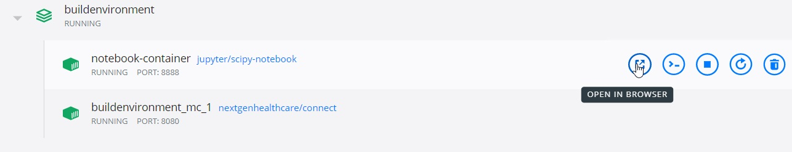
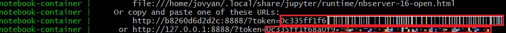
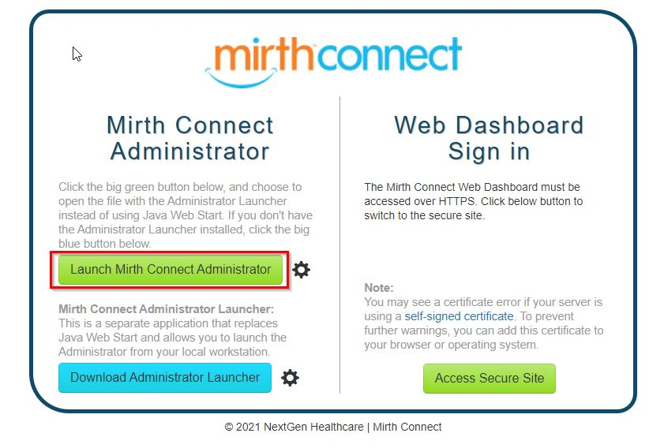
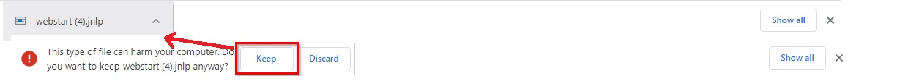
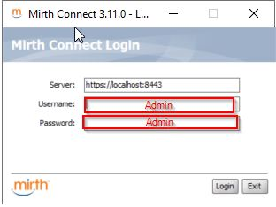

## Reliance eHealth Collaborative HDA Technical Exercise 2021

Congratulations on making it to the technical exercise stage of the Reliance recruiting process!

The exercise has 2 main parts:  
    1) Wrangling flat file and API data in Python 3 and Pandas  
    2) BONUS: Using [MIRTH Connect](https://www.nextgen.com/products-and-services/integration-engine) Clinical Interface Engine to perform some basic data engineering tasks  

We recommend that you `git clone` this repository to easily access the dataset and Docker file.

In order to standardize the development environment for this exercise, we have set up a Docker file which will provision the test environment on your machine, with the necessary components. We suggest you install Docker Desktop on your machine to start. In addition, you will need to locally install:

* git-cli https://git-scm.com/downloads
* docker https://docs.docker.com/get-started/
* vscode https://code.visualstudio.com/?wt.mc_id=vscom_downloads

After installing git-cli navigate to the `/build_environment` folder and run the following command to build the jupyter notebook and mirth connect instance:  
* ```docker-compose up```

The Docker will provision 2 containers with the main exercise components:
* Jupyter notebook (located on port 8888)
* MIRTH Connect Interface Engine  (located on port 8080)

Opening new Jupyter Notebook one of two ways: 
* Open with Docker UI:
    * open Docker UI 
    
    * return to commandline where you ran "docker-compose" and search for the line => http://127.0.0.1:8888/?token= 
    * copy the token and use for "Password or Token" in the browser opened by the Docker UI
* Open from terminal: 
    * after running docker-compose in the terminal you will see the Jupyter Notebook link with token included (paste full link in the browser)
    
    

Note: 
* Any saved files from this notebook are mapped to the local Build Environment directory
    * they can be accessed in this subdirectory: ".\Build Environment\notebook\jovyan\"

### Part 1: Data Wrangling 
The [NPPES NPI Registry](https://npiregistry.cms.hhs.gov/) is a free directory of all active National Provider Identifier (NPI) records. Healthcare providers acquire their unique 10-digit NPIs to identify themselves in a standard way throughout their industry. Provider NPI numbers often occur in healthcare records and claims, and they supply another method of identification in addition to names.

The NPPES NPI Registry also maintains an [API](https://npiregistry.cms.hhs.gov/registry/help-api) in order to allow users to programmatically interface with the registry.

For this technical exercise, we have provided a [flat file](https://github.com/reliancehie/recruiting-hda/blob/main/data/provider_npi_list.tsv) of provider NPIs pulled from Reliance claims records.  These claims are from providers that have ordered Lab results on their patients from commercial labs. The schema of the data in the flat file is:

*laboratory*: name of the lab that performed the result in the claim  
*provider_npi*: unique NPI number of the provider  
*claim_id_count*: number of claims for that provider ordered from the laboratory in this row  

We would like you to utilize the flat file dataset and the NPPES API to answer the following questions:

1) How many claims are there for each lab?
2) Who are the top 25 ordering providers (by NPI number and name)?
3) Of these top 25 providers, what are their addresses?

**NOTE: Please note any data issues you find and explain how you resolve them. 
We suggest programmatically querying the NPPES API and not downloading the bulk csv.**

Please write up your approach in a Python 3.x Jupyter Notebook provisioned by (1-2 pages) and utilize the Pandas and/or Numpy libraries. You are also welcome and encouraged to use other python libraries that support your analysis. Please explain your work!

### BONUS: MIRTH Connect  

Healthcare entities such as hospitals and laboratories that need to exchange clinical data often do so through clinical interface engines such as MIRTH Connect. For this part of the exercise, we would like you to generate a summary csv from the data wrangling exercise and utilize MIRTH Connect to create a Mirth channel. The description of the csv file is as follows: after answering question 3 in Part 1 above (Of these top 25 providers, what are their addresses?), we would like you to create a csv of the top 100 providers with the following fields in this order: 'provider npi', 'provider_last_name', 'provider_first_name', 'provider_address', 'number of claims'  

We would like you to generated MIRTH Connect Channel that *can accomplish* the following tasks:

1) pick up the csv file and write each row to a database (hint: the channel destination configuration should include a SQL insert statement)
2) move the processed file to a "done" folder

*note that we are not asking you to actually create the DB itself and write the rows to a table but we will award bonus points if you do so. However, we want to be clear that this step is absolutely optional. Our main interest here is understanding your thought process for setting up the channel*

### Setting up Mirth: 
* Open Docker UI and locate "buildenvironment_mc_1". Select "OPEN IN BROWSER"
* select "Launch Mirth Connect Administrator" to download the jnlp file mirth needs to launch.   

* you will be prompted to keep or discard this file select "Keep" and open jnlp file:   

* You will be prompted for username password:
    * Username: Admin  
    * Password: Admin  



## Exercise Deliverables  
When you complete the exercise, please email the following files to us at the provided email address  
1) html file of your jupyter notebook from Part 1  
2) csv requested in Part 2  
3) a file (pptx, docx, googledoc,etc) containing screenshots of the MIRTH channel configuration in Part 2  

Once we receive your email, we'll follow up with you to schedule an interview where you will have an opportunity to present your exercise and we will ask technical questions.

Good luck!

The Reliance Data Team
